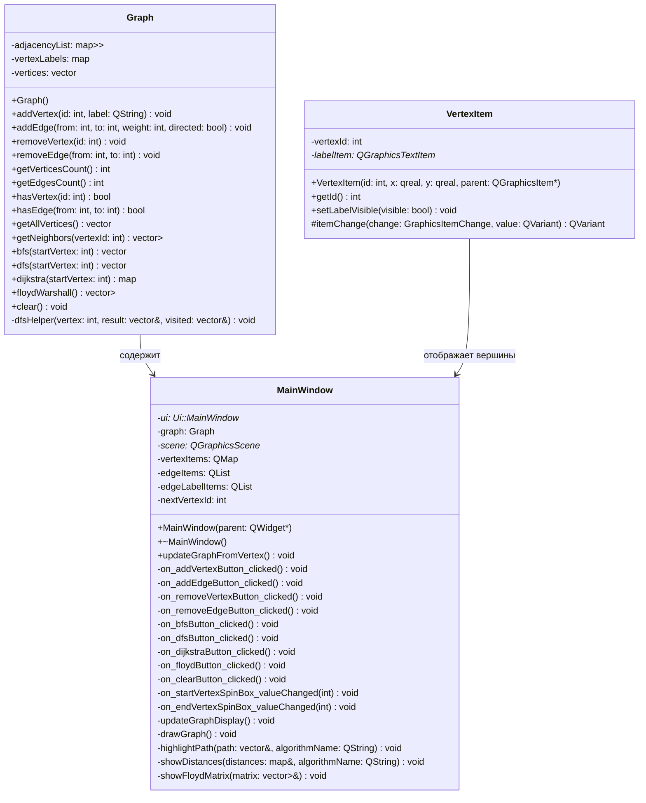

# Лабораторная работа: Обход графов (Вариант 20)

## Описание
Данная лабораторная работа реализует основные алгоритмы обхода графов на C++ с использованием фреймворка Qt для графического интерфейса.

## Реализованные алгоритмы
1. **Обход в ширину (BFS - Breadth-First Search)** - алгоритм поиска в ширину, который исследует все соседние вершины перед переходом к следующему уровню.
2. **Обход в глубину (DFS - Depth-First Search)** - алгоритм поиска в глубину, который исследует как можно дальше по каждой ветви перед возвратом.
3. **Алгоритм Дейкстры** - алгоритм поиска кратчайшего пути от одной вершины до всех остальных во взвешенном графе.
4. **Алгоритм Флойда-Уоршелла** - алгоритм поиска кратчайших путей между всеми парами вершин.

## Структура проекта
```
GraphLab/
├── CMakeLists.txt          # Файл сборки CMake
├── include/
│   ├── graph.h             # Заголовочный файл класса Graph
│   └── mainwindow.h        # Заголовочный файл главного окна
├── src/
│   ├── graph.cpp           # Реализация класса Graph
│   ├── mainwindow.cpp      # Реализация главного окна
│   └── main.cpp            # Точка входа приложения
├── ui/
│   └── mainwindow.ui       # UI файл главного окна
└── README.md               # Этот файл
```

## Требования
- CMake версии 3.10 или выше
- Qt5 или Qt6 (Widgets модуль)
- Компилятор C++ с поддержкой C++17
- VS Code (рекомендуется)

## Сборка и запуск

### Шаг 1: Откройте проект в VS Code
Откройте папку проекта в VS Code.

### Шаг 2: Создайте директорию для сборки
```bash
mkdir build
cd build
```

### Шаг 3: Настройте проект с помощью CMake
```bash
cmake ..
```

Если у вас установлена Qt5:
```bash
cmake -DCMAKE_PREFIX_PATH=/path/to/qt5 ..
```

Если у вас установлена Qt6:
```bash
cmake -DCMAKE_PREFIX_PATH=/path/to/qt6 ..
```

### Шаг 4: Соберите проект
```bash
cmake --build .
```

Или используйте make:
```bash
make
```

### Шаг 5: Запустите приложение
```bash
./GraphLab
```

Или в Windows:
```bash
GraphLab.exe
```

## Использование приложения

### Управление графом
1. **Добавить вершину**: Нажмите кнопку "Добавить вершину" и введите идентификатор вершины.
2. **Добавить ребро**: Нажмите кнопку "Добавить ребро", введите начальную и конечную вершины, а также вес ребра.
3. **Удалить вершину**: Нажмите кнопку "Удалить вершину" и введите идентификатор вершины для удаления.
4. **Удалить ребро**: Нажмите кнопку "Удалить ребро" и введите вершины, соединённые ребром.
5. **Очистить граф**: Нажмите кнопку "Очистить граф" для удаления всех вершин и рёбер.

### Запуск алгоритмов
1. Установите начальную вершину в поле "Начальная вершина" (по умолчанию 20).
2. Выберите нужный алгоритм:
   - **Обход в ширину (BFS)**: Покажет порядок обхода вершин в ширину.
   - **Обход в глубину (DFS)**: Покажет порядок обхода вершин в глубину.
   - **Алгоритм Дейкстры**: Покажет кратчайшие расстояния от начальной вершины до всех остальных.
   - **Алгоритм Флойда-Уоршелла**: Покажет матрицу кратчайших расстояний между всеми парами вершин.

3. Результат выполнения алгоритма отобразится в текстовом поле "Результат".

## Пример использования

1. Добавьте вершины: 20, 1, 2, 3, 4, 5
2. Добавьте рёбра:
   - 20 -> 1 (вес 5)
   - 20 -> 2 (вес 3)
   - 1 -> 3 (вес 2)
   - 2 -> 3 (вес 1)
   - 3 -> 4 (вес 4)
   - 4 -> 5 (вес 2)
3. Запустите алгоритм Дейкстры с начальной вершиной 20
4. Просмотрите кратчайшие расстояния до всех вершин

## Технические детали

### UML-диаграмма классов



### Разъяснение реализованных классов

#### 1. Класс `Graph`
**Назначение:** Базовый класс для представления и работы с графами. Реализует структуру данных графа и основные алгоритмы обхода.

**Поля:**
- `adjacencyList` — список смежности для хранения структуры графа (вершина → список пар {сосед, вес})
- `vertexLabels` — карта меток вершин для отображения пользовательских названий
- `vertices` — вектор всех вершин графа

**Основные методы:**
- **Манипуляция графом:** `addVertex()`, `addEdge()`, `removeVertex()`, `removeEdge()`, `clear()`
- **Информационные методы:** `getVerticesCount()`, `getEdgesCount()`, `hasVertex()`, `hasEdge()`, `getAllVertices()`, `getNeighbors()`
- **Алгоритмы обхода:**
  - `bfs()` — обход в ширину (Breadth-First Search)
  - `dfs()` — обход в глубину (Depth-First Search)
  - `dijkstra()` — алгоритм Дейкстры для поиска кратчайших путей
  - `floydWarshall()` — алгоритм Флойда-Уоршелла для всех пар кратчайших путей
- `dfsHelper()` — вспомогательный рекурсивный метод для DFS

#### 2. Класс `VertexItem`
**Назначение:** Графическое представление вершины графа на сцене Qt. Наследуется от `QGraphicsEllipseItem`.

**Поля:**
- `vertexId` — идентификатор вершины в графе
- `labelItem` — текстовый элемент для отображения метки вершины

**Основные методы:**
- `getId()` — возвращает идентификатор вершины
- `setLabelVisible()` — показывает/скрывает метку вершины
- `itemChange()` — переопределённый метод для отслеживания изменений позиции вершины

#### 3. Класс `MainWindow`
**Назначение:** Главное окно приложения, обеспечивающее графический интерфейс пользователя и связывающее UI с логикой графа.

**Поля:**
- `ui` — указатель на автоматически сгенерированный UI-класс
- `graph` — экземпляр класса `Graph` для хранения данных
- `scene` — графическая сцена Qt для отображения графа
- `vertexItems` — карта графических элементов вершин
- `edgeItems` — список графических элементов рёбер
- `edgeLabelItems` — список элементов меток рёбер
- `nextVertexId` — счётчик для автоматической нумерации вершин

**Основные методы:**
- **Слоты обработки событий UI:** `on_addVertexButton_clicked()`, `on_addEdgeButton_clicked()`, `on_removeVertexButton_clicked()`, `on_removeEdgeButton_clicked()`, `on_bfsButton_clicked()`, `on_dfsButton_clicked()`, `on_dijkstraButton_clicked()`, `on_floydButton_clicked()`, `on_clearButton_clicked()`
- **Методы обновления отображения:** `updateGraphDisplay()`, `drawGraph()`, `highlightPath()`, `showDistances()`, `showFloydMatrix()`
- `updateGraphFromVertex()` — публичный метод для синхронизации данных

### Взаимосвязь классов
- `MainWindow` **содержит** экземпляр `Graph` (композиция)
- `MainWindow` **управляет** коллекцией объектов `VertexItem` для визуализации
- `VertexItem` **отображает** отдельную вершину графа на сцене

### Графический интерфейс
Интерфейс создан с использованием Qt Widgets и включает:
- Графическое отображение графа с помощью QGraphicsView
- Панель управления для добавления/удаления элементов графа
- Панель выбора параметров алгоритмов
- Текстовое поле для вывода результатов

## Авторы
Пархоменко Роман Юрьевич РИС-25-1Б
