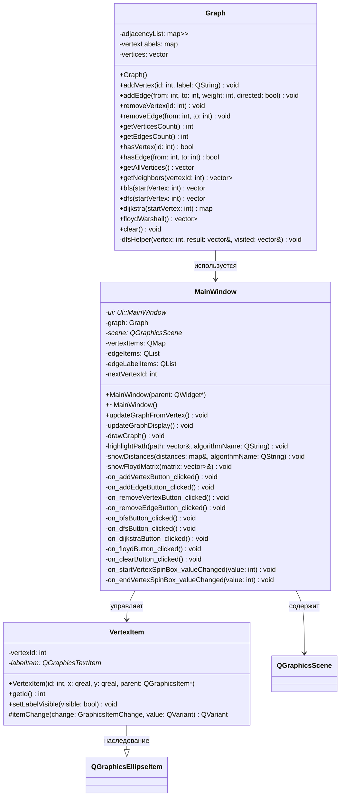
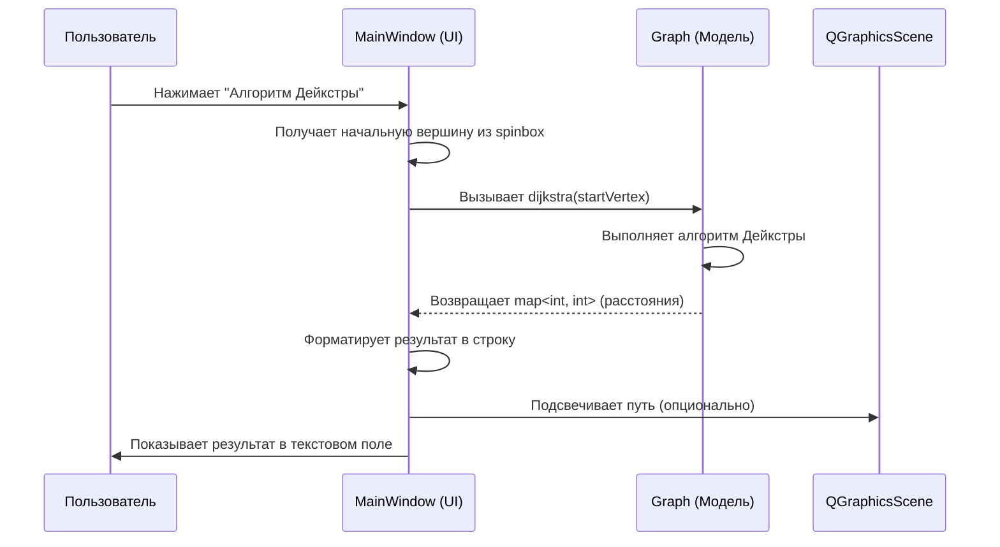

# Лабораторная работа: Обход графов (Вариант 20)

## Описание
Данная лабораторная работа реализует основные алгоритмы обхода графов на C++ с использованием фреймворка Qt для графического интерфейса.

## Реализованные алгоритмы
1. **Обход в ширину (BFS - Breadth-First Search)** - алгоритм поиска в ширину, который исследует все соседние вершины перед переходом к следующему уровню.
2. **Обход в глубину (DFS - Depth-First Search)** - алгоритм поиска в глубину, который исследует как можно дальше по каждой ветви перед возвратом.
3. **Алгоритм Дейкстры** - алгоритм поиска кратчайшего пути от одной вершины до всех остальных во взвешенном графе.
4. **Алгоритм Флойда-Уоршелла** - алгоритм поиска кратчайших путей между всеми парами вершин.

## Вариант 20
Начальная вершина для выполнения алгоритмов: **20**

## Структура проекта
```
GraphLab/
├── CMakeLists.txt          # Файл сборки CMake
├── include/
│   ├── graph.h             # Заголовочный файл класса Graph
│   └── mainwindow.h        # Заголовочный файл главного окна
├── src/
│   ├── graph.cpp           # Реализация класса Graph
│   ├── mainwindow.cpp      # Реализация главного окна
│   └── main.cpp            # Точка входа приложения
├── ui/
│   └── mainwindow.ui       # UI файл главного окна
└── README.md               # Этот файл
```

## Требования
- CMake версии 3.10 или выше
- Qt5 или Qt6 (Widgets модуль)
- Компилятор C++ с поддержкой C++17
- VS Code (рекомендуется)

## Сборка и запуск

### Шаг 1: Откройте проект в VS Code
Откройте папку проекта в VS Code.

### Шаг 2: Создайте директорию для сборки
```bash
mkdir build
cd build
```

### Шаг 3: Настройте проект с помощью CMake
```bash
cmake ..
```

Если у вас установлена Qt5:
```bash
cmake -DCMAKE_PREFIX_PATH=/path/to/qt5 ..
```

Если у вас установлена Qt6:
```bash
cmake -DCMAKE_PREFIX_PATH=/path/to/qt6 ..
```

### Шаг 4: Соберите проект
```bash
cmake --build .
```

Или используйте make:
```bash
make
```

### Шаг 5: Запустите приложение
```bash
./GraphLab
```

Или в Windows:
```bash
GraphLab.exe
```

## Использование приложения

### Управление графом
1. **Добавить вершину**: Нажмите кнопку "Добавить вершину" и введите идентификатор вершины.
2. **Добавить ребро**: Нажмите кнопку "Добавить ребро", введите начальную и конечную вершины, а также вес ребра.
3. **Удалить вершину**: Нажмите кнопку "Удалить вершину" и введите идентификатор вершины для удаления.
4. **Удалить ребро**: Нажмите кнопку "Удалить ребро" и введите вершины, соединённые ребром.
5. **Очистить граф**: Нажмите кнопку "Очистить граф" для удаления всех вершин и рёбер.

### Запуск алгоритмов
1. Установите начальную вершину в поле "Начальная вершина" (по умолчанию 20).
2. Выберите нужный алгоритм:
   - **Обход в ширину (BFS)**: Покажет порядок обхода вершин в ширину.
   - **Обход в глубину (DFS)**: Покажет порядок обхода вершин в глубину.
   - **Алгоритм Дейкстры**: Покажет кратчайшие расстояния от начальной вершины до всех остальных.
   - **Алгоритм Флойда-Уоршелла**: Покажет матрицу кратчайших расстояний между всеми парами вершин.

3. Результат выполнения алгоритма отобразится в текстовом поле "Результат".

## Пример использования

1. Добавьте вершины: 20, 1, 2, 3, 4, 5
2. Добавьте рёбра:
   - 20 -> 1 (вес 5)
   - 20 -> 2 (вес 3)
   - 1 -> 3 (вес 2)
   - 2 -> 3 (вес 1)
   - 3 -> 4 (вес 4)
   - 4 -> 5 (вес 2)
3. Запустите алгоритм Дейкстры с начальной вершиной 20
4. Просмотрите кратчайшие расстояния до всех вершин

## Технические детали

### Класс Graph
Класс `Graph` реализует структуру графа с использованием списка смежности и содержит методы для:
- Добавления/удаления вершин и рёбер
- Обхода в ширину (BFS)
- Обхода в глубину (DFS)
- Алгоритма Дейкстры
- Алгоритма Флойда-Уоршелла

### Графический интерфейс
Интерфейс создан с использованием Qt Widgets и включает:
- Графическое отображение графа с помощью QGraphicsView
- Панель управления для добавления/удаления элементов графа
- Панель выбора параметров алгоритмов
- Текстовое поле для вывода результатов

## Авторы
Лабораторная работа выполнена в рамках учебного курса по структурам данных и алгоритмам.

## UML диаграмма классов



### Описание классов

#### 1. Graph (Модель данных графа)
**Назначение:** Хранение структуры графа и реализация алгоритмов обхода.

**Поля:**
- `adjacencyList` - список смежности для хранения рёбер с весами
- `vertexLabels` - метки вершин для отображения
- `vertices` - список всех вершин графа

**Основные методы:**
- `addVertex()` / `removeVertex()` - добавление/удаление вершин
- `addEdge()` / `removeEdge()` - добавление/удаление рёбер с указанием веса
- `bfs()` - обход графа в ширину (возвращает порядок посещения вершин)
- `dfs()` - обход графа в глубину (возвращает порядок посещения вершин)
- `dijkstra()` - поиск кратчайших путей от начальной вершины (возвращает карту расстояний)
- `floydWarshall()` - поиск кратчайших путей между всеми парами вершин (возвращает матрицу расстояний)

#### 2. VertexItem (Графическое представление вершины)
**Назначение:** Визуализация вершины графа на сцене с возможностью перемещения.

**Наследование:** `QGraphicsEllipseItem`

**Поля:**
- `vertexId` - уникальный идентификатор вершины
- `labelItem` - текстовая метка с номером вершины

**Особенности реализации:**
- Вершина рисуется как круг диаметром 30 пикселей
- Номер вершины центрируется внутри круга
- Поддерживается перетаскивание мышкой (`ItemIsMovable`)
- При перемещении автоматически обновляются связанные рёбра

#### 3. MainWindow (Главное окно приложения)
**Назначение:** Управление пользовательским интерфейсом и взаимодействие между моделью (Graph) и представлением (QGraphicsScene).

**Поля:**
- `ui` - автоматически сгенерированный интерфейс из .ui файла
- `graph` - экземпляр модели графа
- `scene` - графическая сцена для отображения элементов
- `vertexItems` - карта графических элементов вершин
- `edgeItems` - список графических элементов рёбер
- `edgeLabelItems` - список меток весов рёбер

**Основные методы:**
- `drawGraph()` - отрисовка графа на сцене (вершины, рёбра, веса)
- `updateGraphDisplay()` - обновление отображения при изменениях
- `highlightPath()` - подсветка пути при выполнении алгоритмов
- `showDistances()` / `showFloydMatrix()` - вывод результатов алгоритмов
- Слоты обработки кнопок (`on_*_clicked()`) - реакция на действия пользователя

### Взаимодействие классов

1. **MainWindow → Graph**: Главное окно использует объект Graph для хранения данных и выполнения алгоритмов
2. **MainWindow → VertexItem**: Окно создаёт и управляет графическими элементами вершин
3. **VertexItem → QGraphicsEllipseItem**: Вершина наследует функциональность базового класса Qt для работы с графикой
4. **MainWindow → QGraphicsScene**: Окно размещает все графические элементы на сцене для отображения в QGraphicsView

### Диаграмма последовательности для запуска алгоритма Дейкстры


